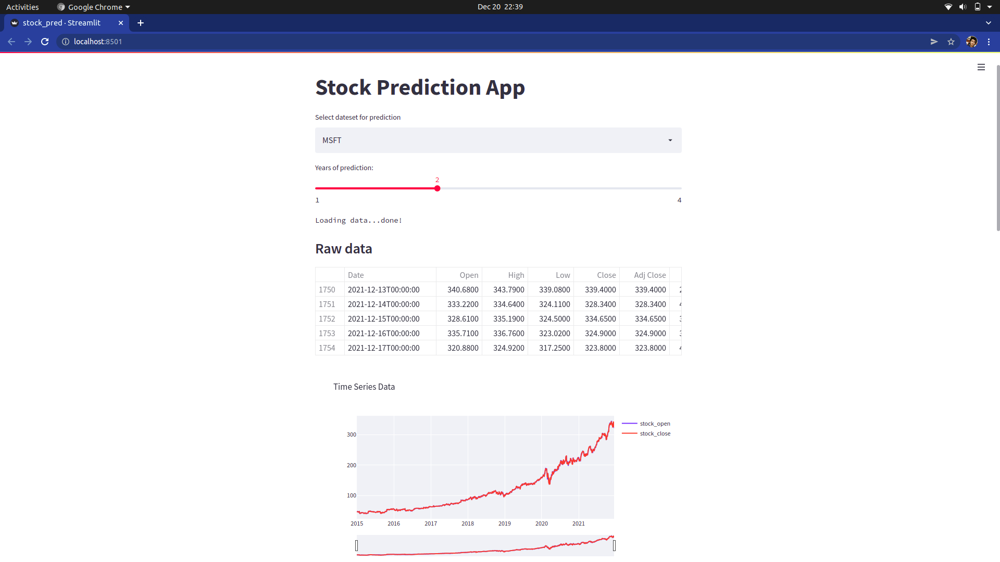
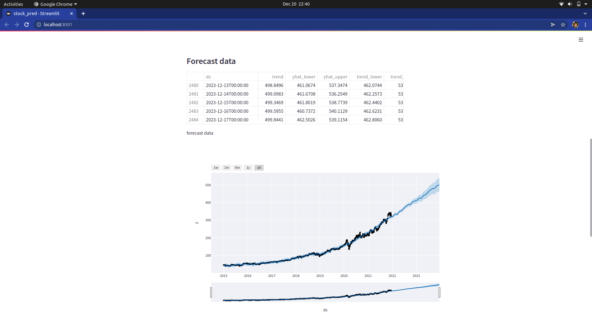
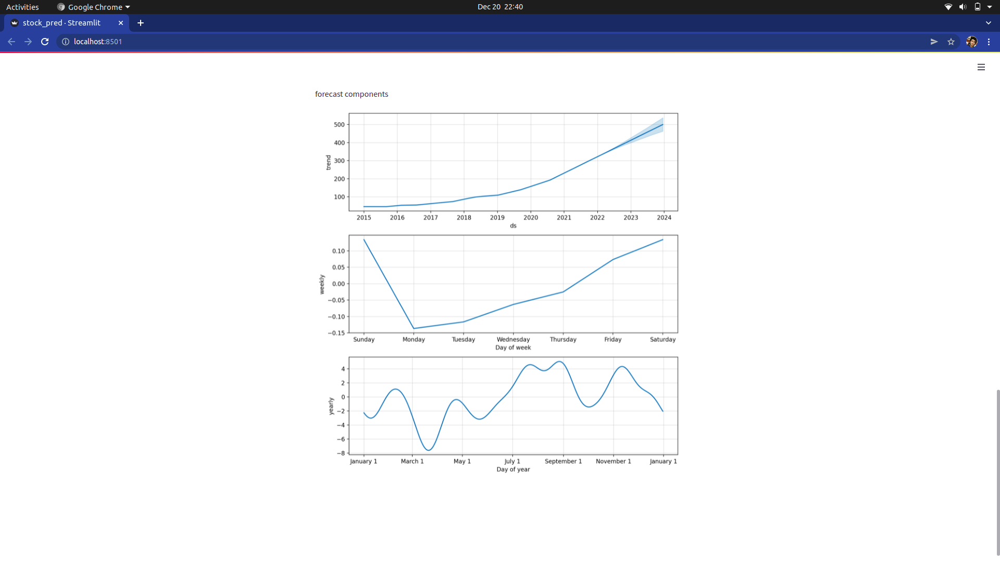

# ML web application for Stock Trend forecasting

Building an interactive machine learning app with Streamlit to forecast Stock Trend.

I have used Yahoo Finance API(yfinance) is a service that provides stock quotes and other financial information for any stock ticker symbol. It provides data of stocks, financial news, press releases and financial reports of companies.

Also fbprophet is used which is a procedure for forecasting time series data based on an additive model where non-linear trends are fit with yearly, weekly, and daily seasonality, plus holiday effects. It works best with time series that have strong seasonal effects and several seasons of historical data.

## Conclusion

The forecasting gives a fair idea of for the weekly and yearly trend of the stock.

